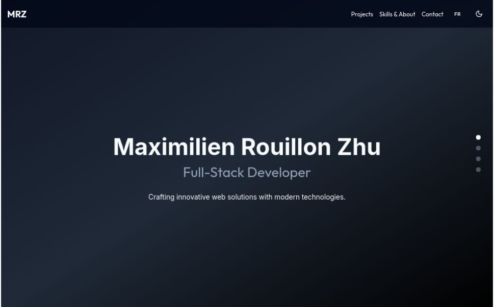

# My Portfolio

This is the source code for my personal portfolio website built with **Next.js**, **Tailwind CSS**, **ShadCN**, and other modern web technologies. It showcases my projects, skills, and experience as a developer.

## 🛠️ Tech Stack

- **Framework**: [Next.js](https://nextjs.org/)
- **UI Components**: [ShadCN UI](https://shadcn.dev/) (based on [Radix UI](https://www.radix-ui.com/))
- **Styling**: [Tailwind CSS](https://tailwindcss.com/)
- **TypeScript**: For static typing and better developer experience
- **Deployment**: [Vercel](https://vercel.com/)
- **Icons**: [Lucide Icons](https://lucide.dev/) and [Skillicons](https://skillicons.dev/)
- **Version Control**: [GitHub](https://github.com/)
[](https://skillicons.dev)

## 🚀 Features

- **Responsive Design**: The website is fully responsive and works on all devices (mobile, tablet, desktop).
- **Project Showcase**: Displays my key projects with details, descriptions, and links.
- **Blog Section**: A place where I write about tech, development, and more.
- **Interactive UI**: Smooth and modern animations, buttons, and components.
- **Dark Mode**: Toggle between dark and light themes for better user experience.

## 📸 Screenshots



## 🛠️ Installation and Setup

1. Clone this repository:
    ```bash
    git clone https://github.com/HOTP0T/portfolio_MRZ
    ```

2. Install the dependencies:
    ```bash
    cd portfolio
    npm install
    ```

3. Run the development server:
    ```bash
    npm run dev
    ```

4. Open your browser and visit [http://localhost:3000](http://localhost:3000) to view the app.

## 🚀 Deployment

This portfolio is hosted on [Vercel](https://vercel.com/). You can easily deploy your own version by connecting this repository to Vercel.

## 🤝 Contributing

Feel free to open an issue or submit a pull request for improvements. Contributions are welcome!

## 📄 License

This project is open-source and available under the [MIT License](LICENSE).

## 🔗 Links

- [Visit My Portfolio](https://portfolio-mrz.vercel.app/)
- [Follow me on GitHub](https://github.com/HOTP0T)